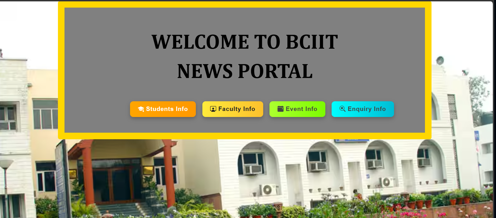
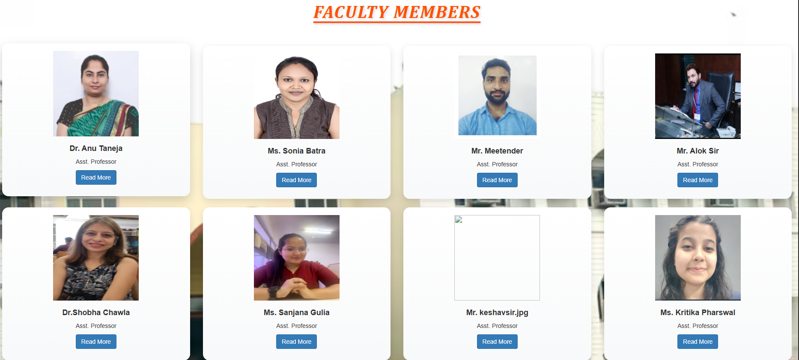
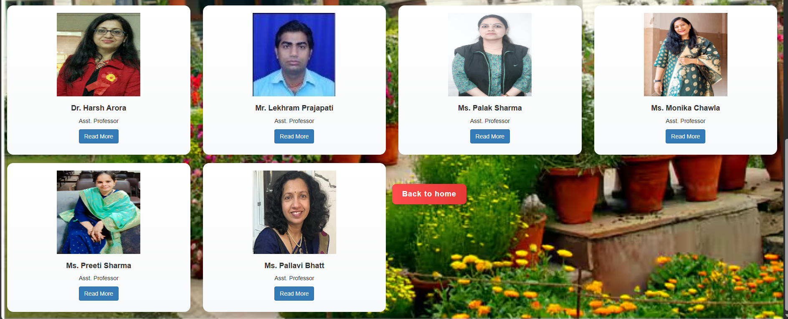
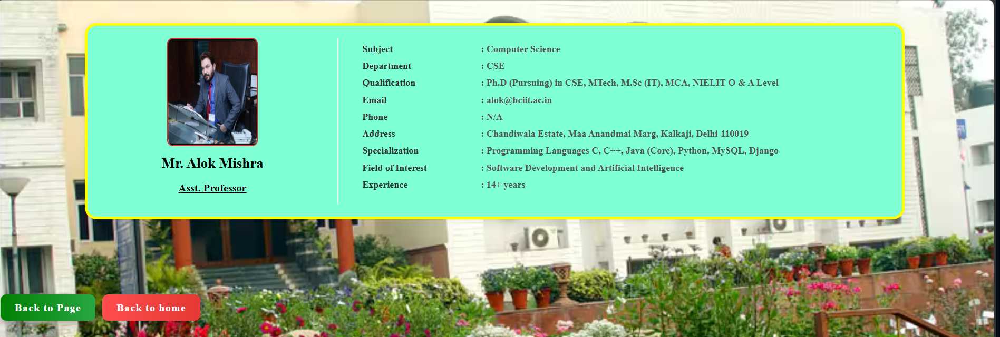
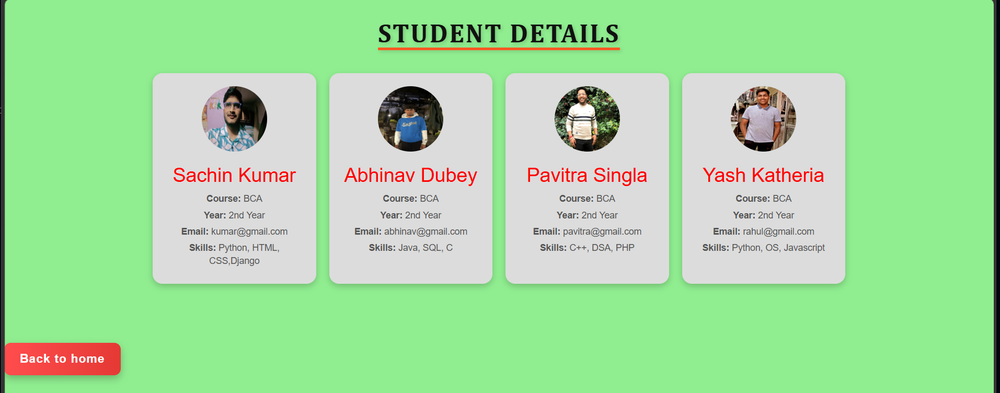
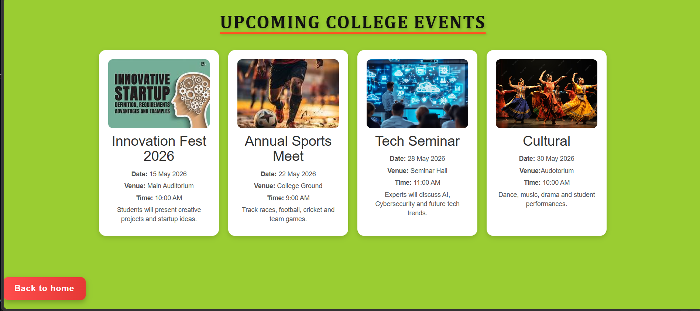
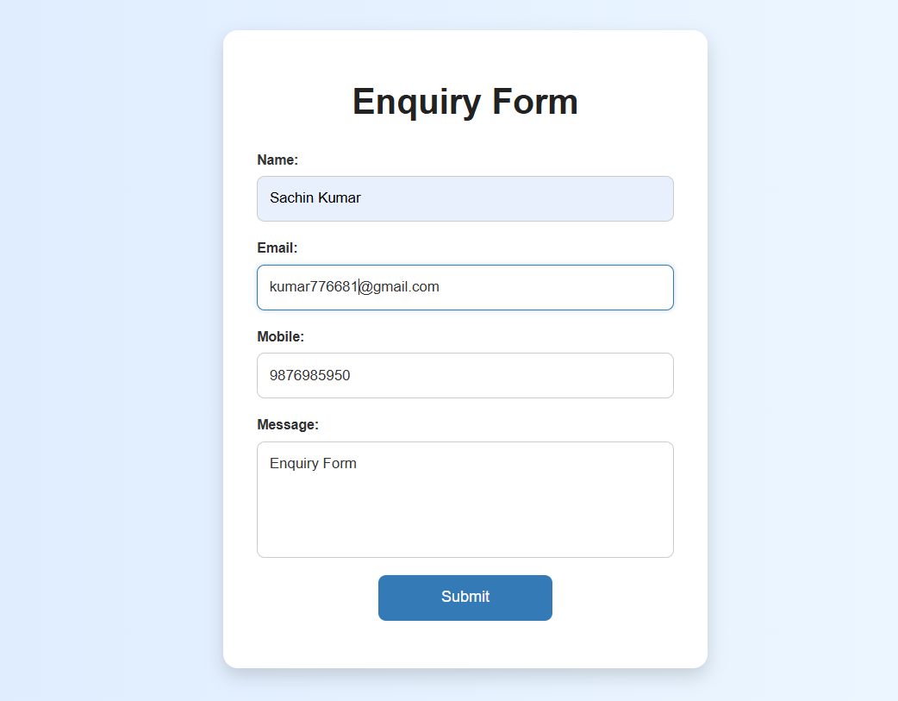
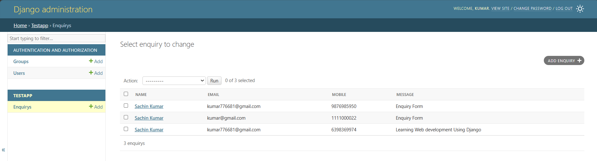

## 🌐 Live Demo

🔗 https://academic-project-gp7y.onrender.com

# Academic Project

A full-stack academic web application developed using Django, Python, HTML, CSS and Bootstrap. This project demonstrates practical implementation of frontend and backend web development concepts with responsive UI and database integration.

---

## 🚀 Features

- User-friendly interface
- Responsive web design
- Authentication/Login system
- Database integration
- Dynamic content handling
- Clean dashboard UI
- Backend functionality using Django
- Academic project structure

---

## 🛠 Technologies Used

- Python
- Django
- HTML
- CSS
- Bootstrap
- SQLite

---

## 📚 Learning Outcome

This project helped in understanding:

- Django Framework
- Backend Development
- Frontend Integration
- Database Management
- Authentication System
- Responsive UI Design
- GitHub Project Management

---
  ## Screenshot

## 👨‍💻 Author

Sachin Kumar

### LinkedIn
[LinkedIn Profile](https://www.linkedin.com/in/sachin-kumar-362b53343/)

### GitHub
[GitHub](https://github.com/SACHIN197-creator)

---

## ⭐ Future Improvements

- Add API integration
- Improve UI animations
- Deploy project online
- Add advanced security features
- Add admin analytics dashboard

